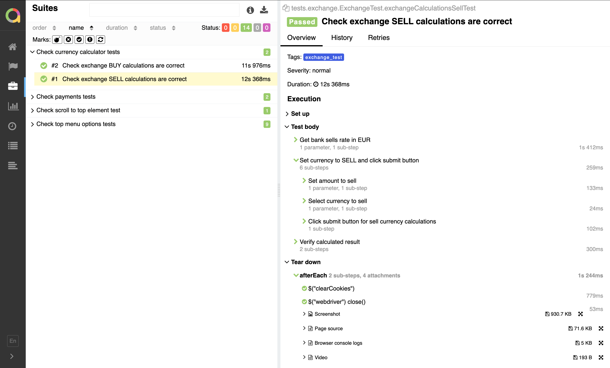
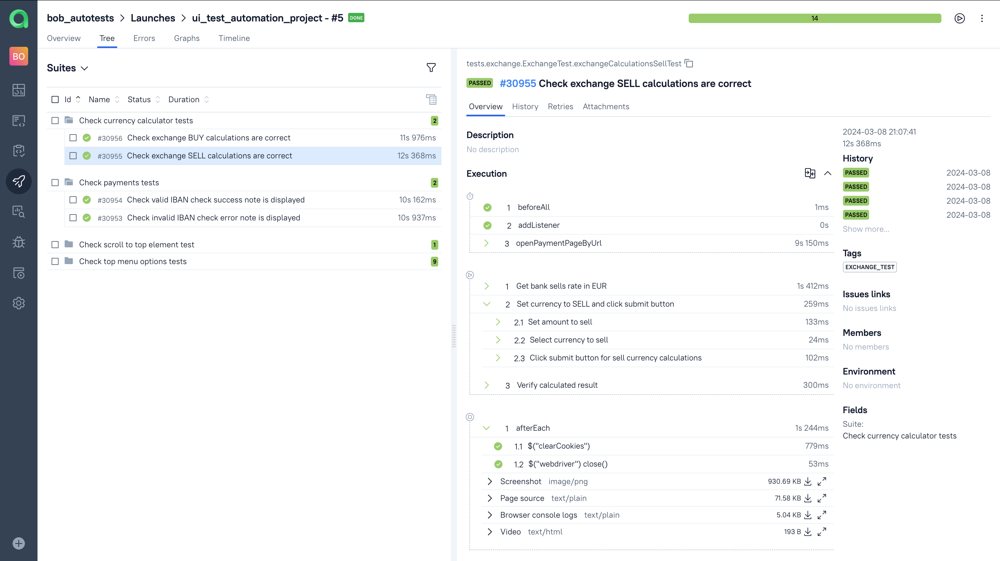
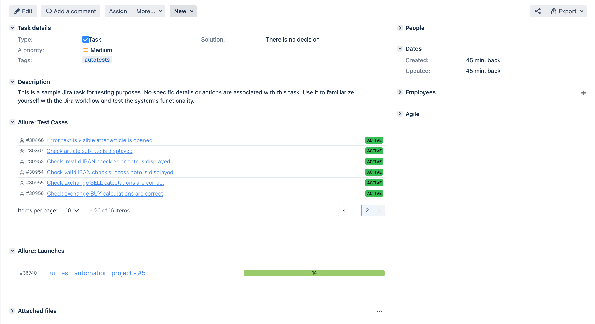
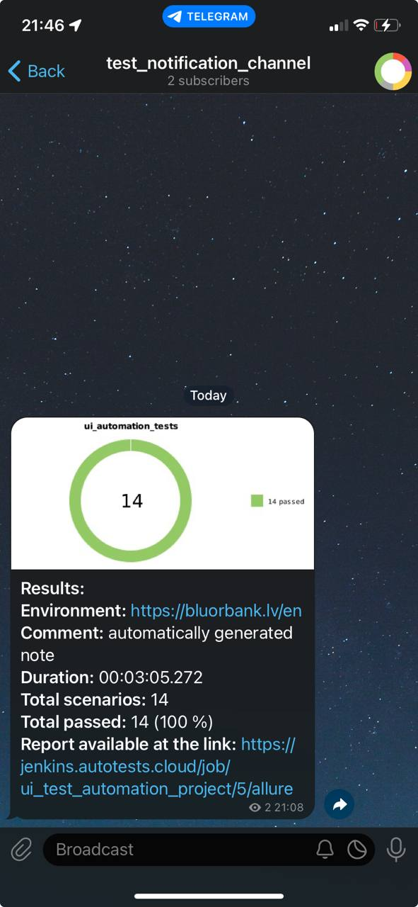

# Demo automation tests for the [BluOr Bank's](https://www.bluorbank.lv/) web application


## 📂 Content:

- <a href="#tools"> Tools</a>
- <a href="#cases"> Test Cases</a>
- <a href="#autotests"> Running Automated Tests</a>
- <a href="#jenkins"> Jenkins Build</a>
- <a href="#allureReport"> Example of Allure Report</a>
- <a href="#allure"> Integration with Allure TestOps</a>
- <a href="#jira"> Integration with Jira</a>
- <a href="#telegram"> Telegram notifications</a>
- <a href="#video"> Example of test execution using Selenoid</a>

____
<a id="tools"></a>
## 🛠 Tools

<p align="center">
<a href="https://www.java.com/"></a>
<a href="https://selenide.org/"></a>
<a href="https://aerokube.com/selenoid/"></a>
<a href="https://github.com/allure-framework/allure2"></a>
<a href="https://qameta.io/"></a>
<a href="https://gradle.org/"></a>
<a href="https://junit.org/junit5/"></a>
<a href="https://www.jenkins.io/"></a>
<a href="https://web.telegram.org/"></a>
<a href="https://www.atlassian.com/ru/software/jira/"></a>
</p>

____

In the <code>[Jenkins](https://www.jenkins.io/)</code> task, an <code>[Allure report](https://allurereport.org/)</code> is generated, and a notification is sent to <code>[Telegram](https://web.telegram.org/)</code> using a dedicated bot. 
The testing environment also connects smoothly with <code>[Allure TestOps](https://qameta.io/)</code> and <code>[Jira](https://www.atlassian.com/software/jira)</code> for complete test management and issue tracking.
It offers both local and remote test execution capabilities and utilizes the "<code>Page Object</code>" design pattern.

The Allure report for each test includes:
- Test steps and their execution results
- Screenshot of the page on the last step
- Page Source (ability to open the source page in a new tab)
- Browser console logs
- Video of the test execution.

____
<a id="cases"></a>
## :male_detective: Test Cases

Automated:
- Check currency exchange calculator tests (Both sell and buy) 
- Check IBAN checker
- Check top menu options in available languages (Parametrized)
- Check company logo exist and verifies href in any language (Parametrized) 
- Check Internet bank login button exists and verifies href in available languages (Parametrized)
- Check that 'scroll to top' element appears by scrolling page down
Manual:
- Check main menu images are uploaded
- Check button style (color and hover/click effects)
- Check font size and style

<a id="autotests"></a>
____
## :arrow_forward: Running Automated Tests

### Running Tests from the Terminal:

To run the automated tests locally:
```bash
gradle clean test -Denv='local'
```

To run the automated tests on Selenoid:
```bash
gradle clean test -Denv='remote'  
```
>The following method will run the tests with the following default parameters:
>+ Remote Url: **selenoid.autotests.cloud**
>+ Browser: **Google Chrome**
>+ Browser version: **100.0**
____
<a id="jenkins"></a>
##  </a> Jenkins Build <a target="_blank"> </a>

Registration on the [Jenkins](https://jenkins.autotests.cloud/) resource is required for access to Jenkins.

To start the build, go to the "Build with parameters" section, select the necessary parameters, and click "Build".
### Jenkins Build Parameters:
- TASK (set of tests to run)
- BROWSER (browser, chrome by default)
- RESOLUTION (browser window size, 1920x1080 by default)
- VERSION (browser version, 100.0 by default. Supports execution in Firefox on versions 98.0 and 97.0, as well as Chrome 99.0 and 100.0)
- BASE (tested site base url)

<p align="center">

</p>

> After the build is completed, icons for "Allure Report" and "Allure TestOps" will appear next to the build number in the "Build History" section. Clicking on these icons opens pages with the generated HTML report and test documentation, respectively.

____
<a id="allureReport"></a>
##  </a> Example of <a target="_blank" href="https://jenkins.autotests.cloud/job/bob_autotests/20/"> Allure Report </a>

<p align="center">

</p>

____
<a id="allure"></a>
##  </a> Integration with <a target="_blank" href="https://allure.autotests.cloud/project/3952/dashboards"> Allure TestOps </a>

On the *Dashboard* in **Allure TestOps**, you can see the statistics of the number of tests: how many of them are added and executed manually, how many are automated. New tests and test run results are sent through the integration with each build.

<p align="center">

</p>

____
<a id="jira"></a>
##  </a> Integration with <a target="_blank" href="https://jira.autotests.cloud/browse/HOMEWORK-1042"> Jira </a>

Integration with **Allure TestOps** and **Jira** is implemented. In the Jira task, you can see which test cases were written as part of the task and their execution results.

<p align="center">

</p>

____
<a id="telegram"></a>
##  Telegram notifications via bot

After the build is complete, a **Telegram** bot automatically processes and sends a message with the test run report to a specifically configured chat.

<p align="left">

</p>

____
<a id="video"></a>
##  </a> Video attachment example

In the Allure reports for each test, a video of the test execution is attached along with a screenshot.

<p align="center">
  
</p>
